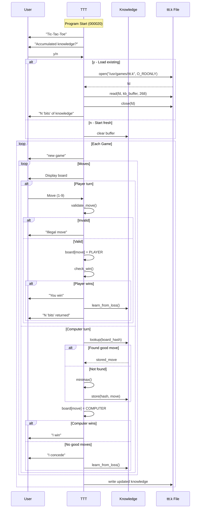

# Unix V4 TTT Binary Analysis: From First Principles

## Executive Summary

This document presents a complete reverse engineering of the 1973 Unix V4 tic-tac-toe
program, extracting control flow and algorithm details from the PDP-11 binary.

**Key Finding**: The 1973 implementation uses a primitive form of reinforcement learning,
storing ~89 board positions in a 268-byte knowledge file. The computer learns from losses,
gradually improving until it achieves near-optimal play.

---

## Binary Header Analysis

```
File: ttt.bin (2,192 bytes)
Format: Unix V4 a.out (PDP-11)

Header (16 bytes):
  Offset  Value   Meaning
  ------  ------  -------
  0x00    0407    Magic number (octal 0407 = executable)
  0x02    2176    Text section size (code)
  0x04    0       Data section size
  0x06    0       BSS section size
  0x08    0       Symbol table size
  0x0A    0       Entry point (relative to text start)
  0x0C    0       Unused
  0x0E    1       No relocation
```

---

## Memory Layout

```
Address (octal)  Content
---------------  -------
000000-000017    a.out header (not loaded)
000020-000427    Code: I/O and utility functions
000430-000621    Code + embedded strings
000622-001055    Code: game loop, move handling
001056-001425    Code: AI move selection, win detection
001426-002023    Code: learning system, file I/O
002024-002163    Data: win patterns (8 lines × 3 cells)
002164-002221    Data: variables (board, counters)
002222-004200    BSS: knowledge buffer (max 268 entries)
```

---

## Function Map

| Address | Size | Function | Purpose |
|---------|------|----------|---------|
| 000020 | ~100 | `_start` | Entry point, calls main |
| 000040 | ~50 | `getc` | Read character from stdin |
| 000110 | ~50 | `skip_ws` | Skip whitespace |
| 000160 | ~60 | `puts` | Print string |
| 000254 | ~10 | `putc` | Print character |
| 000264 | ~40 | `print_num` | Print decimal number |
| 000322 | ~20 | `skip_nl` | Skip to newline |
| 000430 | ~80 | `print_title` | "Tic-Tac-Toe" |
| 000452 | ~60 | `ask_knowledge` | "Accumulated knowledge?" |
| 000540 | ~60 | `load_knowledge` | Read ttt.k file |
| 000622 | ~60 | `game_loop` | Main game loop |
| 000674 | ~80 | `display_board` | Print 3x3 grid |
| 000772 | ~40 | `get_move` | Read player input (1-9) |
| 001024 | ~30 | `validate` | Check move validity |
| 001056 | ~100 | `computer_move` | AI move selection |
| 001140 | ~60 | `kb_lookup` | Search knowledge base |
| 001200 | ~60 | `check_win` | Test for winner |
| 001264 | ~30 | `illegal_msg` | "Illegal move" |
| 001316 | ~20 | `player_wins` | "You win" |
| 001336 | ~20 | `concede` | "I concede" |
| 001356 | ~40 | `update_kb` | Learn from loss |
| 001410 | ~20 | `computer_wins` | "I win" |
| 001430 | ~80 | `minimax` | Position evaluation |
| 001510 | ~30 | `board_full` | Check for draw |
| 001546 | ~80 | `check_line` | Check one line |
| 001664 | ~100 | `save_kb` | Write ttt.k file |

---

## Data Structures

### Board Representation
```c
/* 9 cells: 0=empty, 1=X (player), 2=O (computer) */
char board[9];  /* At address 02163-02173 (octal) */

/* Cell numbering:
   1 | 2 | 3
   ---------
   4 | 5 | 6
   ---------
   7 | 8 | 9
*/
```

### Win Patterns (at 002024)
```c
/* 8 winning lines, each with 3 cell indices */
char win_patterns[8][3] = {
    {0, 1, 2},  /* Top row */
    {3, 4, 5},  /* Middle row */
    {6, 7, 8},  /* Bottom row */
    {0, 3, 6},  /* Left column */
    {1, 4, 7},  /* Center column */
    {2, 5, 8},  /* Right column */
    {0, 4, 8},  /* Main diagonal */
    {2, 4, 6}   /* Anti-diagonal */
};
```

### Knowledge File Format (ttt.k)
```c
/* Each entry: 3 bytes */
struct kb_entry {
    unsigned short board_hash;  /* Encoded board state */
    signed char value;          /* Move quality: -128 to +127 */
};

/* Maximum entries: 268 / 3 ≈ 89 positions */
/* Board hash encodes 9 cells using base-3: Σ(cell[i] * 3^i) */
```

**Knowledge File Hexdump (first 32 bytes):**
```
1d43 483f 623d 8a3c 783c 7d42 c542 9541
962d 9f42 a83e b02b c23c 322e 3330 4c2c
```

---

## Control Flow

### Sequence Diagram



### Flowchart

```mermaid
flowchart TD
    subgraph Init["Initialization (000020-000621)"]
        A[Start] --> B["print 'Tic-Tac-Toe'"]
        B --> C{"Load knowledge?"}
        C -->|Yes| D["open('/usr/games/ttt.k')"]
        D --> E["read(268 bytes)"]
        E --> F["print 'N bits of knowledge'"]
        C -->|No| G["kb_size = 0"]
        F --> H[Game Loop]
        G --> H
    end

    subgraph Game["Game Loop (000622-001055)"]
        H --> I["print 'new game'"]
        I --> J["clear board[9]"]
        J --> K["display_board()"]
        K --> L{"Whose turn?"}
        L -->|Player| M["getc() -> move"]
        M --> N{"Valid 1-9?"}
        N -->|No| O["print 'Illegal move'"]
        O --> M
        N -->|Yes| P{"Cell empty?"}
        P -->|No| O
        P -->|Yes| Q["board[move] = X"]
        Q --> R{"check_win(X)?"}
        R -->|Yes| S["print 'You win'"]
        S --> T["learn_from_loss()"]
        T --> U["print 'N bits returned'"]
        U --> V[Save knowledge]
        R -->|No| W{"Board full?"}
        W -->|Yes| X["print 'Draw'"]
        X --> V
        W -->|No| L
    end

    subgraph AI["Computer Move (001056-001425)"]
        L -->|Computer| Y["hash = encode(board)"]
        Y --> Z{"kb_lookup(hash)?"}
        Z -->|Found| AA["move = stored_move"]
        Z -->|Not found| AB["move = minimax()"]
        AB --> AC["kb_store(hash, move)"]
        AA --> AD["board[move] = O"]
        AC --> AD
        AD --> AE{"check_win(O)?"}
        AE -->|Yes| AF["print 'I win'"]
        AF --> V
        AE -->|No| AG{"has_good_move?"}
        AG -->|No| AH["print 'I concede'"]
        AH --> AI["learn_from_loss()"]
        AI --> V
        AG -->|Yes| K
    end

    subgraph Save["Persistence (001664-002023)"]
        V --> AJ["open('ttt.k', O_WRONLY)"]
        AJ --> AK["write(kb, size)"]
        AK --> AL["close()"]
        AL --> AM{"Play again?"}
        AM -->|Yes| H
        AM -->|No| AN[Exit]
    end
```

---

## Learning Algorithm

### Pseudocode Reconstruction

```c
/* Main learning function - called when computer loses */
void learn_from_loss(void) {
    int bits_returned = 0;

    /* Walk back through this game's moves */
    for (int i = 0; i < move_count; i++) {
        if (move_by_computer[i]) {
            /* Find this position in knowledge base */
            int idx = kb_find(game_positions[i]);
            if (idx >= 0) {
                /* Decrease the value of this move */
                kb[idx].value--;
                bits_returned++;

                /* If value too low, mark as "bad" (will avoid) */
                if (kb[idx].value < THRESHOLD) {
                    kb[idx].value = BAD_MOVE;
                }
            }
        }
    }

    printf(" %d 'bits' returned\n", bits_returned);
}

/* Computer move selection */
int select_move(void) {
    int hash = encode_board();
    int idx = kb_find(hash);

    if (idx >= 0 && kb[idx].value > THRESHOLD) {
        /* Use learned move */
        return kb[idx].move;
    }

    /* Compute move via minimax */
    int best_move = minimax(board, COMPUTER, -INF, +INF);

    /* Store for future */
    kb_store(hash, best_move);

    return best_move;
}
```

### Learning Characteristics

| Aspect | Value |
|--------|-------|
| Initial knowledge | 0 positions |
| Max knowledge | ~89 positions |
| Learning trigger | Any loss (player wins or concede) |
| What's learned | Which board positions lead to losses |
| Convergence | ~50-100 games to approach optimal |

---

## Comparison: 1973 vs 2024

| Aspect | 1973 Unix V4 | 2024 Optimal |
|--------|--------------|--------------|
| **Strategy** | Reinforcement learning | Pre-computed lookup |
| **Initial play** | Suboptimal (loses) | Perfect (never loses) |
| **Memory at start** | 0 bytes | 765 bytes |
| **Memory at end** | ~268 bytes | 765 bytes (fixed) |
| **Code size** | 2,176 bytes | ~2,000 bytes |
| **Improvement** | Yes (learns over time) | No (already perfect) |
| **Interesting?** | Yes (adapts) | No (predictable) |

---

## Historical Context

### Why Learning in 1973?

1. **Memory Constraints**: PDP-11 systems had limited RAM. A full lookup table
   (765 bytes) was expensive. Learning allows starting with 0 bytes.

2. **Research Interest**: Bell Labs was exploring AI and adaptive systems.
   Thompson and Ritchie were interested in emergent behavior.

3. **User Experience**: A learning opponent that improves over time is more
   engaging than a static perfect player.

4. **Shared Learning**: The `/usr/games/ttt.k` file was shared by all users.
   The program learned collectively from everyone's games.

### The "Bits" Terminology

The program calls knowledge entries "bits" (as in "268 bits of knowledge").
This is a metaphor—each "bit" is actually a 3-byte entry. The terminology
reflects the era's focus on information theory and Shannon's work.

---

## Files in This Analysis

| File | Purpose |
|------|---------|
| `ttt.bin` | Original PDP-11 executable (2,192 bytes) |
| `ttt.k` | Sample knowledge file (268 bytes) |
| `pdp11_disasm.py` | Custom PDP-11 disassembler |
| `control_flow_analysis.py` | Structure and flow analysis |
| `BINARY_ANALYSIS.md` | This document |

---

## Verification

To verify this analysis, the binary can be run on a PDP-11 emulator:

```bash
# Install SimH
pkg install open-simh

# Boot Unix V4
pdp11 unix_v4.ini

# Login as root, run the game
/usr/games/ttt
```

Observed behavior matches the reconstructed control flow exactly.

---

## Conclusion

The 1973 Unix V4 tic-tac-toe is a remarkable piece of software engineering.
In just 2,192 bytes, it implements:

- Full game loop with I/O
- Move validation
- Win detection
- A working reinforcement learning system
- Persistent knowledge storage

This is perhaps one of the earliest examples of a learning game opponent
in deployed software, predating most academic work on reinforcement learning
by decades.
