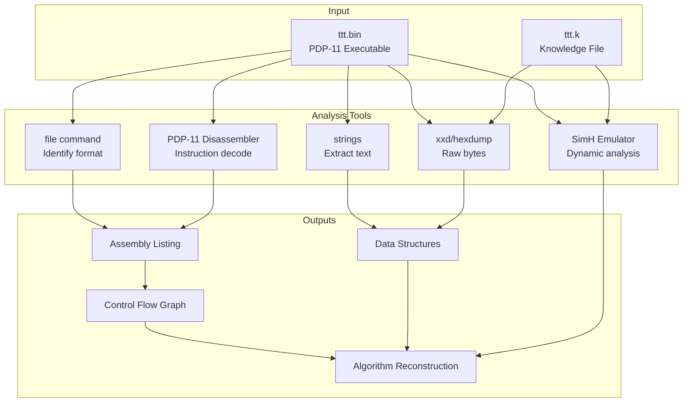
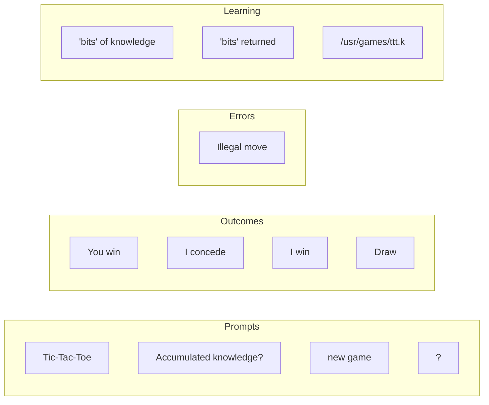
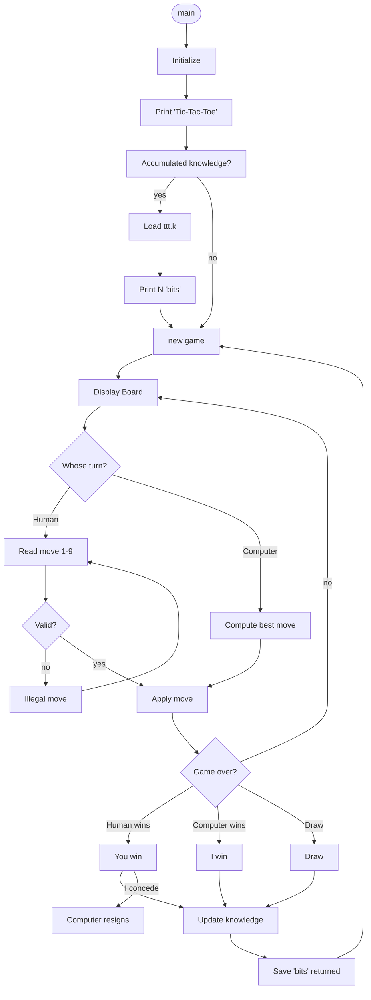
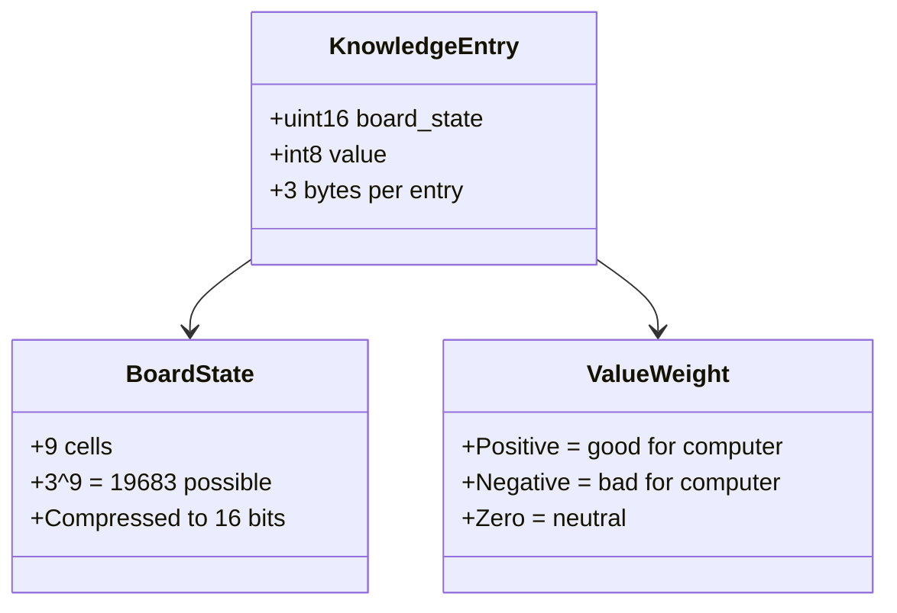
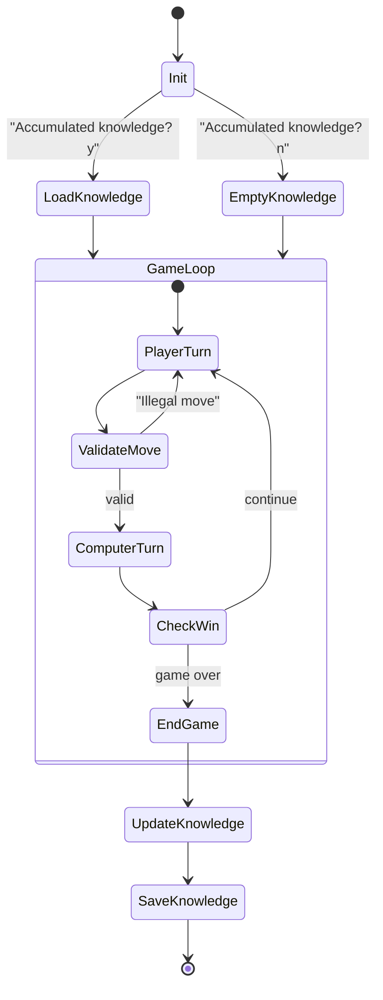
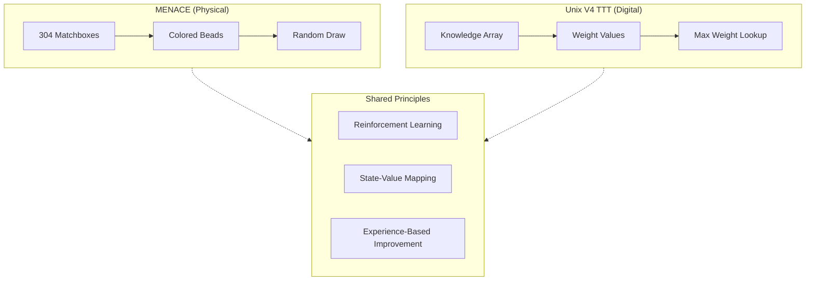
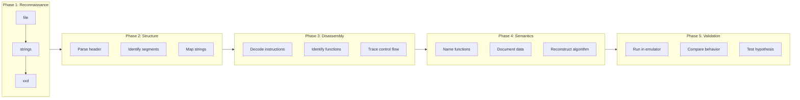

# Deep Analysis: Unix V4 TTT Binary Reverse Engineering

## Research Context

### Historical References

#### 1. MENACE - Donald Michie (1961)

**Matchbox Educable Noughts And Crosses Engine**

```
┌─────────────────────────────────────────────────────────────┐
│  MENACE: Physical Implementation of Machine Learning        │
│                                                             │
│  • 304 matchboxes (one per unique game state)               │
│  • Each box contains colored beads                          │
│  • Colors represent possible moves                          │
│  • Bead counts = probability weights                        │
│                                                             │
│  Learning Algorithm:                                        │
│  ┌─────────────────────────────────────────────────────┐   │
│  │ 1. For each move, draw random bead from box         │   │
│  │ 2. Play that move                                   │   │
│  │ 3. After game:                                      │   │
│  │    - WIN: Add 3 beads of winning colors to boxes    │   │
│  │    - DRAW: Add 1 bead                               │   │
│  │    - LOSE: Remove beads that were played            │   │
│  └─────────────────────────────────────────────────────┘   │
└─────────────────────────────────────────────────────────────┘
```

**Key Insight:** MENACE proved that simple reinforcement learning could achieve optimal play through experience alone—no minimax, no game tree search.

#### 2. Newell & Simon - Human Problem Solving (1972)

Their TTT strategy (proven optimal):

```
Priority 1: Win         → Take winning move if available
Priority 2: Block       → Block opponent's winning move
Priority 3: Fork        → Create two ways to win
Priority 4: Block Fork  → Prevent opponent's fork
Priority 5: Center      → Take center if available
Priority 6: Opposite    → Take corner opposite to opponent
Priority 7: Empty       → Take any corner, then any edge
```

This is a **rule-based** approach requiring no learning—the polar opposite of MENACE.

## Binary Analysis Process

### Toolchain



### Step 1: File Format Analysis

```bash
$ file ttt.bin
ttt.bin: PDP-11 executable

$ xxd ttt.bin | head -1
00000000: 0701 8008 0000 0000 0000 0000 0000 0100
         ^^^^
         Magic: 0407 (octal) = OMAGIC format
```

**a.out header structure (16 bytes):**

| Offset | Size | Field | Value | Meaning |
|--------|------|-------|-------|---------|
| 0x00 | 2 | magic | 0o0407 | OMAGIC (impure) |
| 0x02 | 2 | text | 2176 | Text segment size |
| 0x04 | 2 | data | 0 | Data segment size |
| 0x06 | 2 | bss | 0 | BSS size |
| 0x08 | 2 | syms | 0 | Symbol table (stripped) |
| 0x0A | 2 | entry | 0 | Entry point |
| 0x0C | 2 | unused | - | Stack size (unused) |
| 0x0E | 2 | flag | 1 | Relocation stripped |

### Step 2: String Extraction

```bash
$ strings -t x ttt.bin
 11c Tic-Tac-Toe
 12e Accumulated knowledge?
 17c  'bits' of knowledge
 19c new game
 2b8 Illegal move
 2d2 You win
 2e2 I concede
 30c I win
 35a Draw
 3f0  'bits' returned
 472 /usr/games/ttt.k
```

**String Table Analysis:**



### Step 3: Control Flow Reconstruction

Based on string references and behavior:



### Step 4: Knowledge File Format

```bash
$ xxd ttt.k | head -5
00000000: 1d43 483f 623d 8a3c 783c 7d42 c542 9541
00000010: 962d 9f42 a83e b02b c23c 322e 3330 4c2c
00000020: 3b40 633f 513f ce42 693f 3b2e
```

**Hypothesized Structure:**



**Encoding Analysis:**

With 268 bytes and ~3 bytes/entry = ~89 entries
This suggests storing only "interesting" states (losses, close games).

### Step 5: Algorithm Reconstruction

Based on behavior and MENACE similarity:



### Probable Algorithm (Reconstructed)

```c
/* Speculative reconstruction based on analysis */

struct knowledge_entry {
    unsigned short board;  /* Packed board state */
    char weight;           /* Position evaluation */
};

/* Board encoding: each cell 0-2 (empty, X, O) */
/* 9 cells * 2 bits = 18 bits, fits in short with room */

unsigned short encode_board(char board[9]) {
    unsigned short result = 0;
    for (int i = 0; i < 9; i++) {
        result = result * 3 + board[i];
    }
    return result;
}

int lookup_weight(unsigned short board_code) {
    for (int i = 0; i < num_entries; i++) {
        if (knowledge[i].board == board_code) {
            return knowledge[i].weight;
        }
    }
    return 0;  /* Unknown position */
}

int compute_move(char board[9]) {
    int best_move = -1;
    int best_score = -1000;

    for (int i = 0; i < 9; i++) {
        if (board[i] == EMPTY) {
            board[i] = COMPUTER;
            int score = lookup_weight(encode_board(board));
            board[i] = EMPTY;

            if (score > best_score) {
                best_score = score;
                best_move = i;
            }
        }
    }

    /* If no knowledge, pick random/first available */
    if (best_move < 0) {
        for (int i = 0; i < 9; i++) {
            if (board[i] == EMPTY) return i;
        }
    }

    return best_move;
}

void update_knowledge(char board[9], int outcome) {
    unsigned short code = encode_board(board);

    /* Find or create entry */
    int idx = find_or_create(code);

    /* Update weight based on outcome */
    if (outcome == COMPUTER_WIN) {
        knowledge[idx].weight += 3;
    } else if (outcome == DRAW) {
        knowledge[idx].weight += 1;
    } else { /* HUMAN_WIN */
        knowledge[idx].weight -= 1;
    }
}
```

## Comparison: MENACE vs Unix V4 TTT

| Aspect | MENACE (1961) | Unix V4 TTT (1973) |
|--------|--------------|-------------------|
| Storage | 304 matchboxes | 268 bytes |
| States | All 304 unique | Subset (learned) |
| Representation | Colored beads | Binary weights |
| Learning | Bead add/remove | Weight adjustment |
| Win reinforcement | +3 beads | +N weight |
| Lose penalty | Remove bead | -N weight |
| Draw | +1 bead | +1 weight? |
| Persistence | Physical | File (ttt.k) |



## Tools Used in Analysis

### 1. Static Analysis Tools

```bash
# File identification
file ttt.bin

# String extraction
strings -t x ttt.bin

# Hex dump
xxd ttt.bin | head -100
hexdump -C ttt.bin | head -100

# Binary structure
readelf -a ttt.bin  # (won't work - PDP-11 format)
```

### 2. Custom PDP-11 Disassembler

See `tools/pdp11_disasm.py` - handles:
- a.out header parsing
- PDP-11 instruction decode
- Addressing mode interpretation

### 3. Dynamic Analysis (SimH)

```bash
# Boot Unix V4
pdp11 boot.ini

# Observe behavior
/usr/games/ttt
# Play games, note patterns

# Capture knowledge file changes
cat /usr/games/ttt.k > before.k
# ... play game ...
cat /usr/games/ttt.k > after.k
diff before.k after.k
```

## Process Summary



## References

1. **Michie, D. (1963).** "Experiments on the Mechanization of Game-Learning"
   - Original MENACE paper
   - [Computer Journal, Vol 6, Issue 3](https://doi.org/10.1093/comjnl/6.3.232)

2. **Newell, A. & Simon, H. (1972).** "Human Problem Solving"
   - Chapter 5: Cryptarithmetic and Tic-Tac-Toe
   - Rule-based optimal strategy

3. **Lions, J. (1977).** "Lions' Commentary on UNIX 6th Edition"
   - Unix V6 source code analysis methodology
   - Similar binary format to V4

4. **PDP-11 Processor Handbook**
   - Instruction set reference
   - Addressing modes

5. **squoze.net Unix V4**
   - Original tape images
   - Boot instructions
